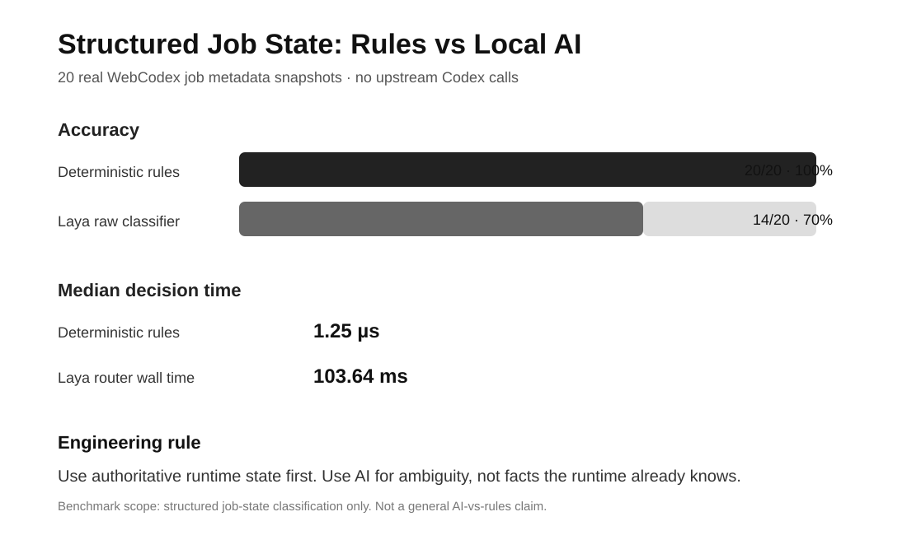

# Shengjie Builds AI

Software engineer and AI researcher building and testing **AI coding agents** in public.

I focus on:

- **Codex / agentic software engineering**
- **MCP and tool orchestration**
- **Agent reliability, routing, and recovery**
- **Developer productivity with measurable evidence**

## Free resource

### [Agent Reliability Checklist](guides/agent-reliability-checklist.md)

A practical 24-point scoring checklist for state, tool selection, permissions, checkpoints, idempotency, verification, fallbacks, observability, recovery, cost, and evaluation.

Core principle:

> **Use deterministic facts first. Use AI for ambiguity. Use stronger AI for reasoning. Use humans for authority.**

## Latest finding

### Sometimes the best AI optimization is less AI

I compared a tiny deterministic state parser with my local Laya routing layer using **20 real WebCodex Job lifecycle metadata snapshots**.

| Metric | Deterministic gate | Laya route-only |
|---|---:|---:|
| Accuracy | **20/20 (100%)** | **14/20 (70%) raw** |
| Median decision time | **1.25 µs** | **103.64 ms router wall time** |
| Upstream Codex calls started | 0 | 0 |

The lesson is narrow but useful:

> **When the runtime already has authoritative structured state, parse it directly. Use AI for ambiguity, not for facts the system already knows.**

→ [Full deterministic-vs-AI benchmark](benchmarks/deterministic-vs-laya-job-state-2026-10-07.md)

## First routing benchmark

Before that, I ran a controlled **40-case synthetic route-only benchmark** against the same Laya → WebCodex routing layer.

| Metric | Result |
|---|---:|
| Total synthetic cases | 40 |
| Raw status classification accuracy | 18/30 (60%) |
| Local accepts at confidence ≥ 0.90 | 0 |
| Non-status tasks rejected by outer gate | 5/5 |
| Unsafe local completion accepts | 0 |
| Upstream Codex calls started | 0 |

**Interpretation:** the current local-AI threshold is conservative. It avoided unsafe local takeovers in this benchmark, but it did **not** demonstrate meaningful upstream-call savings.

→ [Full routing benchmark](benchmarks/laya-router-2026-10-07.md)

## How I work

I publish:

- measured results, including negative results;
- failure autopsies instead of polished demos only;
- clear separation between **measured facts** and **hypotheses**;
- reproducible agent-engineering experiments when possible.

I do **not** claim token, latency, or cost savings until the experiment actually measures them.

---

**Building in public:** AI Coding Agents · MCP · Codex · Agent Reliability · Developer Productivity
