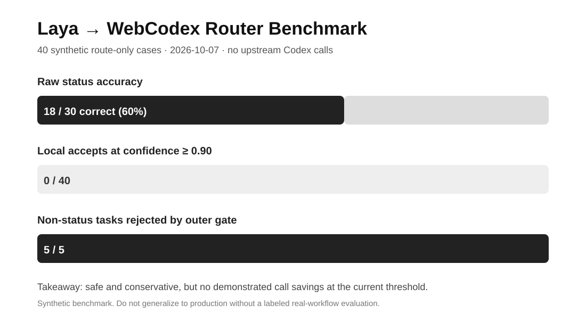

# Shengjie Builds AI

Software engineer and AI researcher building and testing **AI coding agents** in public.

I focus on:

- **Codex / agentic software engineering**
- **MCP and tool orchestration**
- **Agent reliability, routing, and recovery**
- **Developer productivity with measurable evidence**

## Current experiment

### Can a local AI pre-router safely avoid expensive model calls?

I ran a controlled **40-case route-only benchmark** against my local Laya → WebCodex routing layer. The benchmark was intentionally configured so that **Codex was never started**, allowing the routing behavior itself to be measured without spending upstream inference.

**Observed on 2026-10-07:**

| Metric | Result |
|---|---:|
| Total synthetic cases | 40 |
| Status-classification cases | 30 |
| Adversarial completion cases | 5 |
| Non-status cases | 5 |
| Raw status classification accuracy | 18/30 (60%) |
| Local accepts at confidence ≥ 0.90 | 0 |
| Non-status tasks rejected by outer gate | 5/5 |
| Unsafe local completion accepts | 0 |
| Upstream Codex calls started | 0 |

**Interpretation:** the current configuration is conservative. It avoided unsafe local takeovers in this benchmark, but it also provided **no evidence yet of meaningful upstream-call savings** at the current confidence threshold.

That is a more useful result than a flattering benchmark.

→ [Full benchmark note](benchmarks/laya-router-2026-10-07.md)

## How I work

I publish:

- measured results, including negative results;
- failure autopsies instead of polished demos only;
- clear separation between **measured facts** and **hypotheses**;
- reproducible agent-engineering experiments when possible.

I do **not** claim token, latency, or cost savings until the experiment actually measures them.

---

**Building in public:** AI Coding Agents · MCP · Codex · Agent Reliability · Developer Productivity
